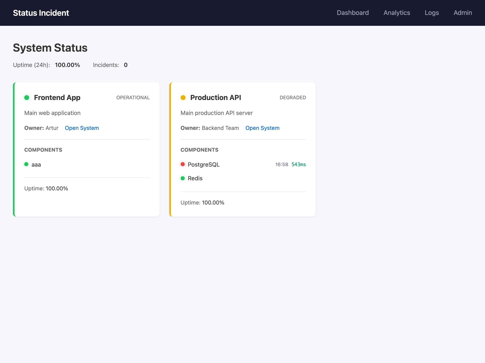
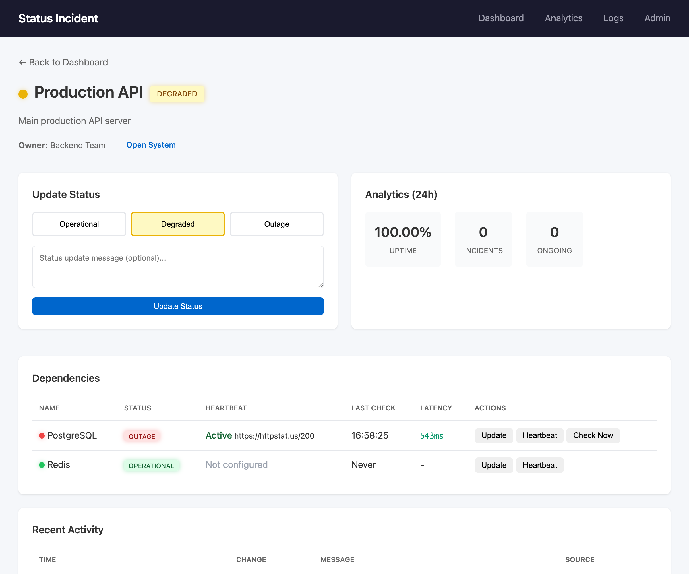
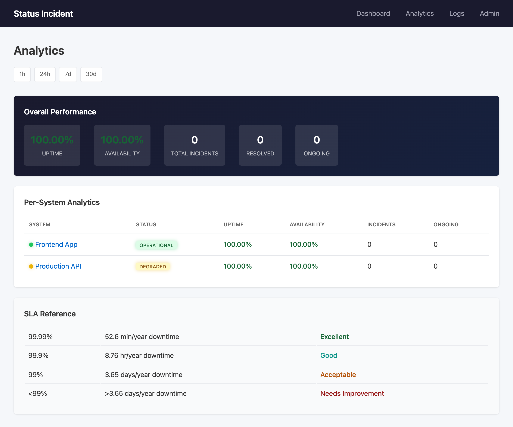
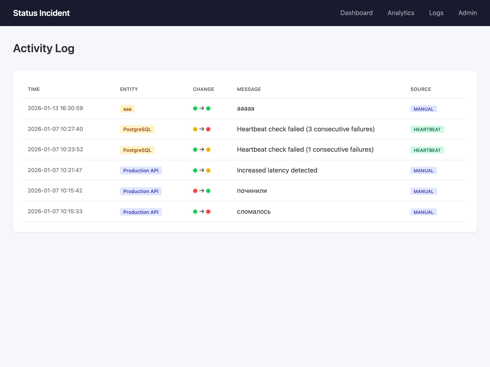
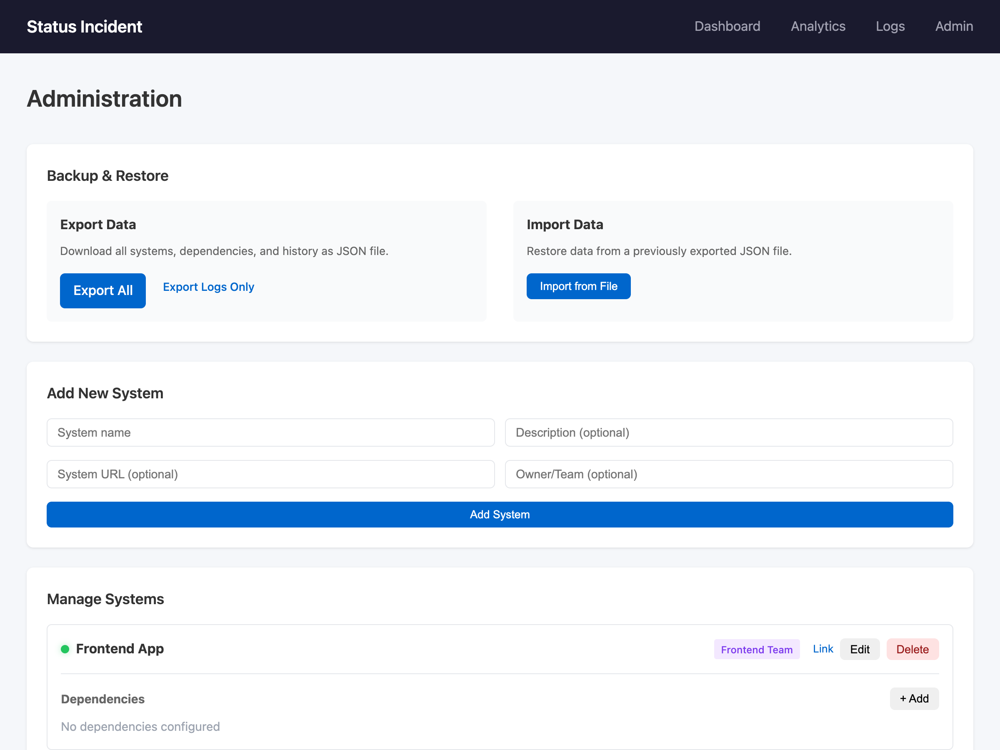

# Status Incident Service

[](https://go.dev/)
[](https://github.com/pomaxa/status-service/actions)
[](LICENSE)
[](https://sqlite.org/)
[](Dockerfile)

Internal service for monitoring system status and tracking incidents.

## Screenshots

### Dashboard
Overview of all systems with real-time status indicators, uptime metrics, and component health.



### System Details
Detailed view of a specific system with status controls, 24h analytics, and dependency management.



### Analytics
Performance metrics including uptime percentage, availability, incident counts, and SLA reference table.



### Activity Log
Complete history of all status changes with timestamps, source tracking (manual/heartbeat), and messages.



### Administration
System management interface with backup/restore functionality, system creation, and dependency configuration.



## Features

- **System Management** - add projects/services with description, URL, and owner
- **Dependencies** - track components of each system (DB, Redis, API, etc.)
- **Traffic Light Status** - green (operational), yellow (degraded), red (outage)
- **Manual Updates** - change status with comments
- **Heartbeat Monitoring** - automatic URL health checks every minute
- **Change History** - complete log of all status changes
- **Analytics** - uptime/SLA, incident count, MTTR

## Tech Stack

- **Backend:** Go + chi router
- **Database:** SQLite (WAL mode)
- **Frontend:** HTML templates + vanilla JS
- **Architecture:** DDD (Domain-Driven Design)

## Getting Started

### Using Docker (recommended)

```bash
# Build and run with docker-compose
docker-compose up -d

# Or build manually
docker build -t status-incident .
docker run -p 8080:8080 -v status-data:/app/data status-incident
```

### Local Build

```bash
# Build
go build -o status-incident .

# Run (port 8080)
./status-incident
```

Service will be available at http://localhost:8080

### API Documentation

Swagger UI is available at http://localhost:8080/swagger/

## Project Structure

```
├── main.go                     # Entry point
├── internal/
│   ├── domain/                 # Business logic (entities, value objects)
│   ├── application/            # Use cases (services)
│   ├── infrastructure/         # SQLite repositories, HTTP checker
│   └── interfaces/             # HTTP handlers, background workers
├── templates/                  # HTML templates
└── static/                     # CSS styles
```

## Web Interface

| Page | URL | Description |
|------|-----|-------------|
| Dashboard | `/` | Overview of all systems |
| System | `/systems/{id}` | System details and dependencies |
| Admin | `/admin` | Manage systems |
| Logs | `/logs` | Change history |
| Analytics | `/analytics` | Statistics and SLA |

## REST API

### Systems

```bash
# List systems
GET /api/systems

# Create system
POST /api/systems
{"name": "API", "description": "Main API", "url": "https://api.example.com", "owner": "Backend Team"}

# Get system
GET /api/systems/{id}

# Update system
PUT /api/systems/{id}
{"name": "API", "description": "Updated", "url": "https://api.example.com", "owner": "Backend Team"}

# Delete system
DELETE /api/systems/{id}

# Change status
POST /api/systems/{id}/status
{"status": "yellow", "message": "Degraded performance"}
```

### Dependencies

```bash
# List dependencies
GET /api/systems/{id}/dependencies

# Add dependency
POST /api/systems/{id}/dependencies
{"name": "PostgreSQL", "description": "Main database"}

# Update dependency
PUT /api/dependencies/{id}

# Delete dependency
DELETE /api/dependencies/{id}

# Change dependency status
POST /api/dependencies/{id}/status
{"status": "red", "message": "Connection lost"}

# Configure heartbeat
POST /api/dependencies/{id}/heartbeat
{"url": "https://api.example.com/health", "interval": 60}

# Disable heartbeat
DELETE /api/dependencies/{id}/heartbeat

# Force check
POST /api/dependencies/{id}/check
```

### Analytics

```bash
# Overall analytics
GET /api/analytics?period=24h

# System analytics
GET /api/systems/{id}/analytics?period=7d

# All logs
GET /api/logs?limit=100
```

### Export / Import

```bash
# Export all data (systems, dependencies, logs)
GET /api/export
# Returns JSON file download

# Export only logs
GET /api/export/logs

# Import data from backup
POST /api/import
Content-Type: application/json
# Body: exported JSON data
```

**Export format:**
```json
{
  "exported_at": "2024-01-15T10:30:00Z",
  "version": "1.0",
  "systems": [
    {
      "id": 1,
      "name": "API",
      "description": "Main API",
      "url": "https://api.example.com",
      "owner": "Backend Team",
      "status": "green",
      "created_at": "2024-01-01T00:00:00Z",
      "updated_at": "2024-01-15T10:00:00Z"
    }
  ],
  "dependencies": [
    {
      "id": 1,
      "system_id": 1,
      "name": "PostgreSQL",
      "description": "Main database",
      "status": "green",
      "heartbeat_url": "https://api.example.com/health/db",
      "heartbeat_interval": 60,
      "created_at": "2024-01-01T00:00:00Z"
    }
  ],
  "logs": [
    {
      "id": 1,
      "system_id": 1,
      "old_status": "green",
      "new_status": "yellow",
      "message": "High latency detected",
      "source": "manual",
      "created_at": "2024-01-15T09:00:00Z"
    }
  ]
}
```

**Import response:**
```json
{
  "systems_imported": 5,
  "dependencies_imported": 12,
  "logs_imported": 150,
  "errors": []
}
```

## Heartbeat Monitoring

### How It Works

The service performs HTTP GET requests to configured heartbeat URLs every minute.

**Status determination:**
- **GREEN** - HTTP 2xx response (200, 201, 204, etc.)
- **YELLOW** - 1-2 consecutive failures (non-2xx or timeout)
- **RED** - 3+ consecutive failures

### Health Endpoint Examples

Your service should expose a health endpoint that returns appropriate HTTP status codes.

#### GREEN Status (Operational)

```http
GET /health HTTP/1.1
Host: your-service.com

HTTP/1.1 200 OK
Content-Type: application/json

{"status": "ok"}
```

Any 2xx response is considered healthy:
- `200 OK`
- `201 Created`
- `204 No Content`

#### YELLOW Status (Degraded)

Returned after 1-2 consecutive check failures:

```http
GET /health HTTP/1.1
Host: your-service.com

HTTP/1.1 503 Service Unavailable
Content-Type: application/json

{"status": "degraded", "message": "Database connection slow"}
```

Non-2xx responses that trigger degraded status:
- `500 Internal Server Error`
- `502 Bad Gateway`
- `503 Service Unavailable`
- `504 Gateway Timeout`
- Connection timeout
- DNS resolution failure

#### RED Status (Outage)

Returned after 3+ consecutive check failures:

```http
GET /health HTTP/1.1
Host: your-service.com

HTTP/1.1 500 Internal Server Error
Content-Type: application/json

{"status": "error", "message": "Database unreachable"}
```

### Recommended Health Endpoint Implementation

```go
// Go example
func healthHandler(w http.ResponseWriter, r *http.Request) {
    // Check your dependencies
    if err := db.Ping(); err != nil {
        w.WriteHeader(http.StatusServiceUnavailable)
        json.NewEncoder(w).Encode(map[string]string{
            "status": "error",
            "message": err.Error(),
        })
        return
    }

    w.WriteHeader(http.StatusOK)
    json.NewEncoder(w).Encode(map[string]string{
        "status": "ok",
    })
}
```

```javascript
// Node.js example
app.get('/health', async (req, res) => {
    try {
        await db.query('SELECT 1');
        res.json({ status: 'ok' });
    } catch (err) {
        res.status(503).json({ status: 'error', message: err.message });
    }
});
```

### Request Details

The heartbeat checker sends requests with:
- **Method:** GET
- **Timeout:** 10 seconds
- **User-Agent:** `StatusIncident-HealthChecker/1.0`
- **Redirects:** Follows up to 10 redirects

## License

MIT
